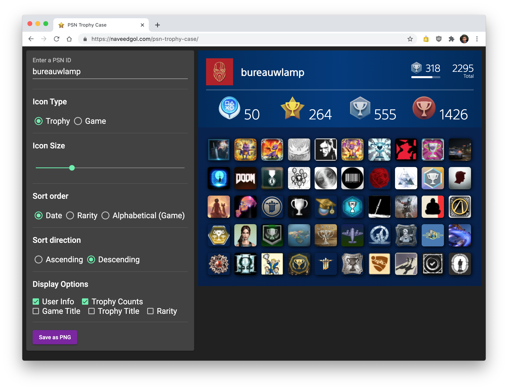

# PSN Trophy Case

## Development server

Run `ng serve` for a dev server. Navigate to `http://localhost:4200/`. The app will automatically reload if you change any of the source files.

## Build

Run `./build.sh` to build and deploy the project.
